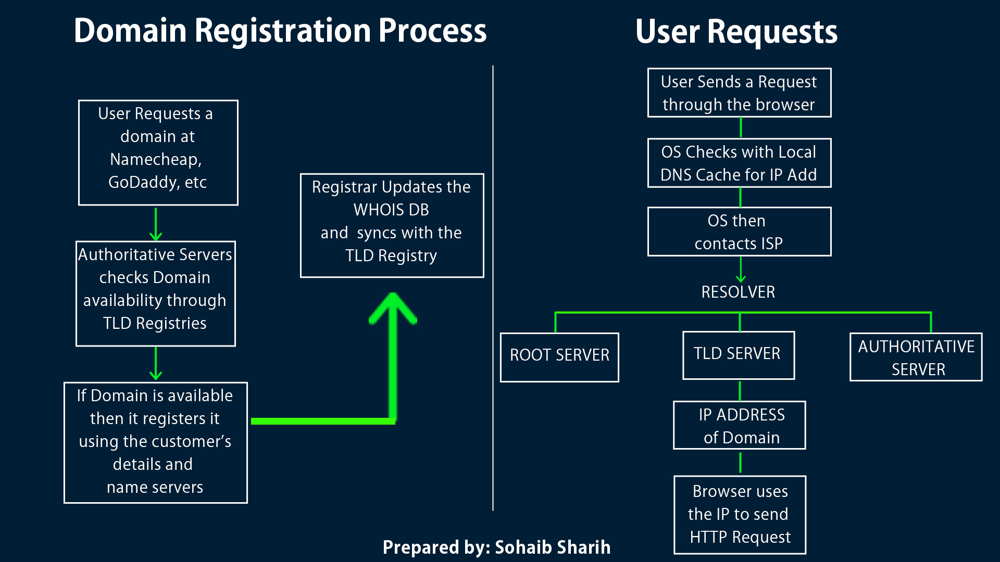
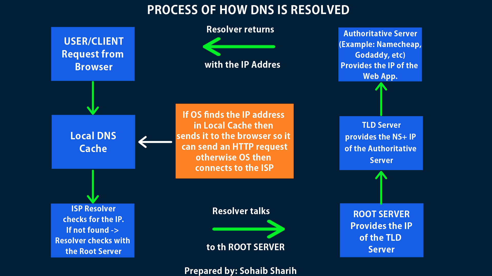

### How a DNS is resolved

To understand what a Domain Name Server is and how it works, we need to understand the following:
1. Domain
2. TLD (Top - Level - Domain)
3. Domain Registration
4. DNS Database Servers
5. DNS Authoritative or Top-Level DNS Servers

#### Objective

1. Find the **IP Address** of the domain name.
2. Search through the Cached list of Domain Name Servers Databases and storage, to look for the IP address.
3. Understanding the ***Role of a resolver***
4. Difference between TLD, Root Servers and Authoritative Servers.

### Domain Registration Journey

1. A user approaches a Domain and Hosting Service provider like Namecheap.com to register a domain.
2. The registrar checks the database of TLD registry to scan if the domain you are requesting for is available or already registered by another owner.
3. Upon success, it then ***registers*** data like *Owner's name, Postal Address, Name servers it will be pointing to;* the data is stored in a ***distributed database system*** called the **WHOIS**.
4. The registrar then syncs only the required data at the TLD Registry from the local database.
5. **Domain Data Cache/Storage:** In order to resolve a DNS quickly, the TLD Registry is the primary source where the domain name list along with the **associated TLD Server IPs**. This list is cached at the ***ISP level***. But there are thousands of domains being registered every hour, so how does the ISP update its cache? *This is done by a set period of time called **TTL (Time To Live)** so that the ISP Resolver doesn't have to go through the long process of going to the ROOT SERVER, then to the TLD SERVER and then finally to the AUTHORITATIVE SERVER where the web application actually lives.*

#### What "Data Refreshed/Invalidated" Means

This refers to **caching**. Most DNS servers you interact with (like your ISP's) are **recursive resolvers**, not authoritative ones. 

- **Caching:** To save time, these resolvers store a copy of your domain's information for a set period called **TTL (Time to Live)**.
- **Invalidation:** Once that TTL time expires, the cached data is considered "invalid" or "stale".
- **Retrieval:** The resolver must then go back through the chain—Root -> TLD -> Authoritative—to fetch the latest, up-to-date information. This is why changes to your site's IP address might take a few hours to show up for everyone; it's waiting for those old caches to expire.




### The Journey of how a DNS is resolved?

1. **User/Client:** A user enters the domain name on the browser, and the browser checks the local DNS Cache to get the ip address. If its not found, then the OS sends the request to the *resolver.*
2. If its not found in the OS cache, then the request is sent to the **Resolver**. *A resolver is the ISP (Internet Service Provider), who also knows how to find the **Root Server.*** The resolver checks its cache, if not found there either, then it should be able to locate the *root server.*
3. **Root Server:** Incase if the root server is unable to locate the domain, it will provide the location of the (Example: .COM) **Top-Level-Domain** Server. *There are only 13 organizations around the world that handle the **ROOT Servers**, each organization has its own distributed system of servers that stores this data.* Ref link: https://root-servers.org/
4. **IP Address:** If the Root Server doesn't have the IP address of the Domain name, then it tells the resolver the name of the domain ***Name servers*** is pointing to.
5. **Resolver stores the Name Servers:** The resolver takes the ***name servers*** of the **Authoritative Name Servers** and saves them in their database, then it searches for the **Authoritative Name Servers**, which is the .COM server.
6. **TLD .COM Server (Example: ns1.dnsimple.com)**: - Then, ns1.dnsimple.com gave me the IP for dnsimple.com. The OS (Operating **System**) whose browser requested for the IP address now receives it and can send the request to retrieve data for the **user/client**.

Below diagram illustrates the flow:



Saving Data:

1. The Resolver saves the Name Server names so it doesn't have to go to the Root server and the TLD(Top level domain servers, example .COM server).

Example Python Script to check how the domain is resolved

```
import dns.query
import dns.message
import dns.resolver


# 1. ROOT SERVER ADDRESS (One of the 13, e.g., 'a.root-servers.net')

ROOT_SERVER = '198.41.0.4'
 

def simulate_dns_lookup(domain):
    print(f"--- Starting DNS Lookup for: {domain} ---\n")

    # STEP 1: Simulate Browser & OS Cache Check
    # In reality, the OS and Browser handle this. We simulate a "Cache Miss".

    print("[1] Browser & OS: Checking local cache... No record found.")
    print("[2] Browser: Requesting OS to fetch IP from DNS Resolver (ISP).")

    # STEP 2: The Resolver's Journey (Mimicking your ISP)

    print(f"[3] Resolver: Cache miss at ISP. Contacting Root Server at {ROOT_SERVER}...")

    # Query Root for TLD (e.g., .com)

    query = dns.message.make_query(domain, dns.rdatatype.A)
    response = dns.query.udp(query, ROOT_SERVER)

    # Root provides TLD servers (Authority section)

    tld_server_ip = response.additional[0][0].address
    print(f"[4] Root Server: 'I don't know {domain}, but here is the .com TLD server IP: {tld_server_ip}'")

    # STEP 3: Contact TLD Server

    print(f"[5] Resolver: Contacting TLD Server at {tld_server_ip}...")
    response = dns.query.udp(query, tld_server_ip)

    # TLD provides Authoritative Name Servers

    auth_ns_ip = None

    # We look for the IP of the authoritative server in the additional section
    for rrset in response.additional:

        if rrset.rdtype == dns.rdatatype.A:
            auth_ns_ip = rrset[0].address
            break
    print(f"[6] TLD Server: 'I found the authoritative servers for this domain. Go ask: {auth_ns_ip}'")


    # STEP 4: Final Authoritative Lookup

    print(f"[7] Resolver: Contacting Authoritative Server at {auth_ns_ip}...")
    response = dns.query.udp(query, auth_ns_ip)

    # Final IP Address

    final_ip = response.answer[0][0].address
    print(f"\n[SUCCESS] Authoritative Server: 'The IP for {domain} is {final_ip}'")
    print(f"[8] Resolver: Returning IP to OS, which saves it to cache and gives it to Browser.")

    print(f"[9] Browser: Connecting to {final_ip} to load your website.")

if __name__ == "__main__":
    simulate_dns_lookup("google.com")

```

#### What this script proves:

- **Layer 1 (The Cache):** The [Browser and OS check their own memory](https://www.freecodecamp.org/news/how-dns-works-the-internets-address-book/) first. My script simulates a "miss" to force the full journey.
- **Layer 2 (The Root):** The Recursive Resolver (ISP) starts at the [13 global root IPs](https://root-servers.org/).
- **Layer 3 (The Referral):** Instead of an IP, the [Root Server provides a "Referral"](https://labs.apnic.net/index.php/2025/03/15/the-root-of-the-dns-2/) to the TLD servers (like Verisign for `.com`).
- **Layer 4 (The Answer):** The [Authoritative Name Server](https://www.geeksforgeeks.org/python/network-programming-in-python-dns-look-up/) finally provides the **A Record** (IP Address).

#### How to see the real OS cache (Manual Check)

If you want to see the **actual** OS cache the browser uses before it hits Python or the ISP: 
- **Windows:** Run `ipconfig /displaydns` in the command prompt.
- **macOS:** Open the Console app and filter for `mDNSResponder`.

--------------
### Understanding how the Resolver Works?

1. How the Resolver reaches the TLD? *The **Root Server** provides the **IP addresses** of the TLD servers.*
	- The Root doesn't just say "Go talk to Verisign"; it says "Go talk to the .com Registry at `192.5.6.30` (one of the COM.L-SERVERS.NET IPs)."
	- The resolver now has a direct destination to send its next packet.
2. **The TLD Registry's Role:** *The TLD (e.g., `.com`) does indeed hold the main registry. As you noted, it usually only sees the **names** of the authoritative servers (e.g., `ns1.bluehost.com`).* To prevent the resolver from getting lost, the TLD provides **Glue Records**.

3. The **"Glue Record" (The Secret Sauce)**: *If you register a domain and use your own custom nameservers (like `ns1.yourdomain.com`), the TLD provides **both** the Name and the **IP Address** of those servers in the same response.*
4. **The Final Handshake**: *Now that the resolver has the **IP of the Authoritative Server**:*

	a. **Contact:** The resolver sends a request directly to that IP.
	b. **Answer:** The Authoritative Server looks at its internal Zone File and says: _"Yes, I am the boss of this domain. The web application's IP is `93.184.216.34`."_
	c. **Completion:** The resolver takes that final IP, gives it to your OS/Browser, and you finally see the website.

### Resolving the DNS and avoiding the infinite Loop

1. Once the Resolver reaches the TLD server, it provides the name of Name Servers along with the IP Address of the name server for the **Authoritative Servers**.
2. If TLD had just provided the names of the name servers, and told the resolver to find the IP of the domain name, the resolver would still require an IP address to ***find*** and ***locate*** the name servers. This is what we call an Infinite Loop.
3. **Solution:** The TLD Servers provides the names of the Name Servers + IP Addresses of the Name Servers. *Example ns1.example.com (124.198.198.200)*

### At what stage does the resolver find the IP Address of the domain itself?

#### Breakdown and flow:

1. The Distinction: NS IP vs. Domain IP

- **The Name Server IP:** This is the IP of the _computer_ that holds the records (e.g., `ns1.namecheap.com` lives at `198.41.0.4`).
- **The Domain IP:** This is the IP of the _web server_ hosting your site (e.g., `example.com` lives at `93.184.216.34`).

2. At what stage does the resolver get the Domain IP?

The resolver only figures out the **IP of the main domain** at the **very last step**—when it talks to the **Authoritative Server**. The TLD **does not** know your website's IP address. It only knows how to find the server that _does_ know.

3. How the Glue Records fit in (The "Pointer" stage)

The TLD provides **Glue Records** only for the **Name Servers**, not for the domain itself.

**The precise flow:**

- **Resolver to TLD:** "I need the IP for `example.com`."
- **TLD Response:** "I don't have that IP. But `example.com` uses Name Servers called `ns1.nameserver.com`. Here is the **Glue Record**: the IP for that Name Server is `1.2.3.4`."
- **Resolver Action:** The resolver uses that IP (`1.2.3.4`) to travel to the **Authoritative Server**.
- **Resolver to Authoritative Server:** "Now that I've found you, what is the IP for the website `example.com`?"
- **Authoritative Server Response:** "The website is at `93.184.216.34`."

4. Are Subdomain IPs the same as the Main Domain? ***Not necessarily.** This is entirely up to how you configure your DNS records on the Authoritative Server:*

	- **Same IP:** Often, `www.example.com` and `example.com` point to the same web server.
	- **Different IP:** You might have `blog.example.com` hosted on a completely different server (different IP) than your main site.
	- **The Process is the same:** For a subdomain like `blog.example.com`, the resolver still goes to the same Authoritative Server and asks: _"What is the IP for the 'blog' record?"_

### Root Servers vs. TLD Servers

1. **Root Servers:** These are the **"Global Receptionists."** They only know one thing: "Which organization is in charge of which extension?" They do **not** hold any data about individual domains like `google.com`.
2. **TLD Servers:** These are the **"Department Managers."** Each TLD (like `.com`, `.org`, `.uk`) has its own set of dedicated servers managed by a specific **Registry**. For example, **Verisign** manages the `.com` TLD servers, while **Public Interest Registry** manages `.org`.
3. **How the Redirection Works**?
The Root servers are not a distributed network of the TLDs; rather, the Root servers **contain a list** (called the Root Zone File) that maps TLDs to their respective Registry servers.

**Process Flow:**

1. **Request:** Your resolver asks a **Root Server**: "Where is `example.com`?"
2. **Check:** The Root server looks at the end of the query (`.com`).
3. **Redirect:** It checks its list and finds that **Verisign** handles `.com`. It replies to the resolver: _"I don't know the domain, but here are the IP addresses + Name Servers for Verisign's .com servers."
4. **Handoff:** The resolver leaves the Root server and starts a brand new conversation with the **TLD Server** provided.

### Who holds the DNS records?

- **Root Servers:** Hold **zero** domain records. They only hold TLD info.
- **TLD Servers:** Hold the "pointer" records ([NS records](https://www.cloudflare.com/learning/dns/dns-records/dns-ns-record/)) that tell the world which **Authoritative Server** (like Namecheap, Cloudflare, or your own server) actually has the final DNS records.
- **Authoritative Servers:** These are the ones that actually hold the "A records" (the website IPs).


### Conclusion

The resolver "figures out" the IP address of the main domain **only after it successfully queries the Authoritative Server.** Everything before that (Root and TLD) was just a series of directions to help the resolver find the right "office" to ask the final question.

- **TLD gives:** Directions to the office (Name Server IP).
- **Authoritative Server gives:** The actual answer (Website IP).

|Step|Server|Provides to Resolver|
|---|---|---|
|**Root**|Root Server|IP of the **TLD Server**|
|**TLD**|Registry Server|Name + IP (**Glue Record**) of the **Authoritative Server**|
|**Final**|Authoritative Server|IP of the **Web Application**|


Reference Links:

1. [MDN](https://developer.mozilla.org/en-US/docs/Learn_web_development/Howto/Web_mechanics/What_is_a_domain_name#how_does_a_dns_request_work)
2. [How does the DNS Work?](https://howdns.works/ep7/)
3. [How DNS works video link](https://www.youtube.com/watch?v=72snZctFFtA&t=45s)
